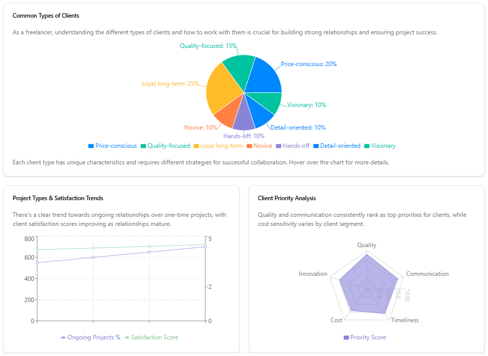

# Freelance Course Dashboard

This project is a comprehensive dashboard designed for freelancers, providing insights into market trends, client demographics, and skills distribution. Built with React, TypeScript, and Vite, it offers a modern and responsive user interface.



## Features

- **Market Overview**: Visualize market growth and trends.
- **Client Insights**: Understand client demographics and preferences.
- **Freelancer Analysis**: Analyze skills distribution and market demand.
- **Collaboration Insights**: Learn about effective client collaboration strategies.

## Technologies Used

- **React**: A JavaScript library for building user interfaces.
- **TypeScript**: A superset of JavaScript that adds static types.
- **Vite**: A fast build tool for modern web projects.
- **Recharts**: A composable charting library built on React components.
- **Tailwind CSS**: A utility-first CSS framework for styling.

## Getting Started

To get a local copy up and running, follow these steps:

1. Clone the repository:
   ```bash
   git clone https://github.com/yourusername/freelance-course-dashboard.git
   ```

2. Navigate to the project directory:
   ```bash
   cd freelance-course-dashboard
   ```

3. Install the dependencies:
   ```bash
   npm install
   ```

4. Start the development server:
   ```bash
   npm run dev
   ```

5. Open your browser and go to `http://localhost:3000` to view the dashboard.

## Contributing

Contributions are welcome! Please follow these steps:

1. Fork the repository.
2. Create a new branch (`git checkout -b feature/YourFeature`).
3. Make your changes and commit them (`git commit -m 'Add some feature'`).
4. Push to the branch (`git push origin feature/YourFeature`).
5. Open a pull request.

## License

This project is licensed under the MIT License - see the [LICENSE](LICENSE) file for details.
